# DeepTutor — Architecture Diagrams

Visual reference for how components connect and how messages flow through each
major feature of the system.

> Code paths reference the `deeptutor/` package unless otherwise noted.

---

## Table of Contents

1. [System Overview](#1-system-overview)
2. [WebSocket Runtime — Message Exchange](#2-websocket-runtime--message-exchange)
3. [Chat Capability — Agentic Pipeline](#3-chat-capability--agentic-pipeline)
4. [Deep Solve — Plan → ReAct → Write](#4-deep-solve--plan--react--write)
5. [Deep Question — Idea → Generate → Validate](#5-deep-question--idea--generate--validate)
6. [Deep Research — Decompose → Research → Report](#6-deep-research--decompose--research--report)
7. [Knowledge Base — Document Indexing](#7-knowledge-base--document-indexing)
8. [Knowledge Base — RAG Retrieval](#8-knowledge-base--rag-retrieval)
9. [Embedding System — Endpoint Transparency (v1.3.2)](#9-embedding-system--endpoint-transparency-v132)
10. [Memory System — Update & Cleanup (v1.3.2)](#10-memory-system--update--cleanup-v132)
11. [TutorBot — Multi-Channel Autonomous Agent](#11-tutorbot--multi-channel-autonomous-agent)
12. [Session & State Management](#12-session--state-management)
13. [Co-Writer — Document Editing & AI Assistance](#13-co-writer--document-editing--ai-assistance)
14. [Module Dependency Hierarchy](#14-module-dependency-hierarchy)

---

## 1. System Overview

All entry points funnel into `ChatOrchestrator`, which dispatches to a
two-level plugin system backed by shared services.

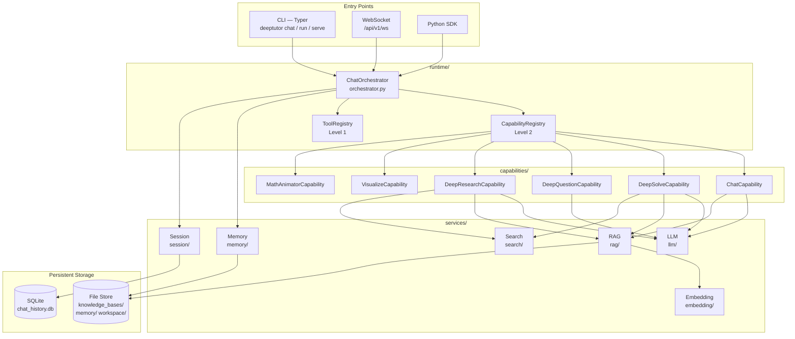

---

## 2. WebSocket Runtime — Message Exchange

How a browser or SDK client creates a turn, receives a streaming response, and
performs lifecycle operations over the single `/api/v1/ws` endpoint.

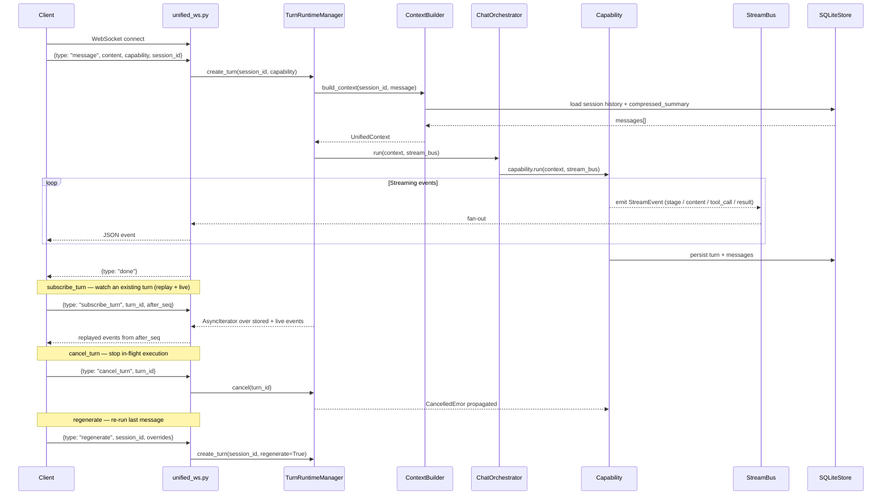

---

## 3. Chat Capability — Agentic Pipeline

The default capability. An agentic loop drives tool selection and response
generation through four internal stages.

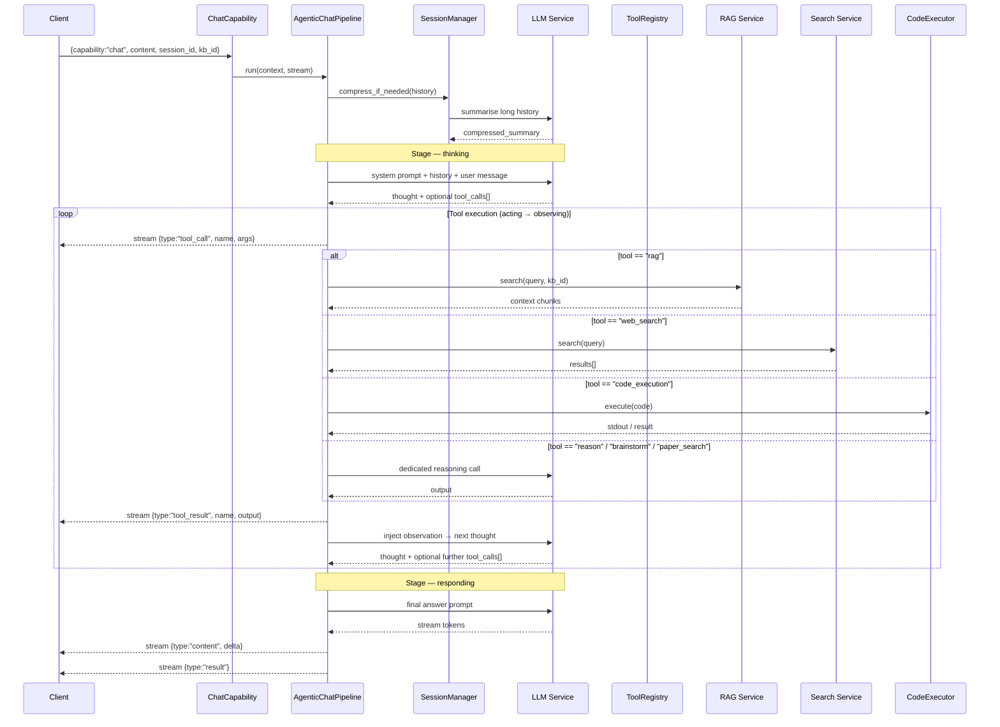

---

## 4. Deep Solve — Plan → ReAct → Write

Three-phase pipeline for structured problem solving. `MainSolver` creates and
orchestrates the three agents; each phase has its own LLM call sequence.

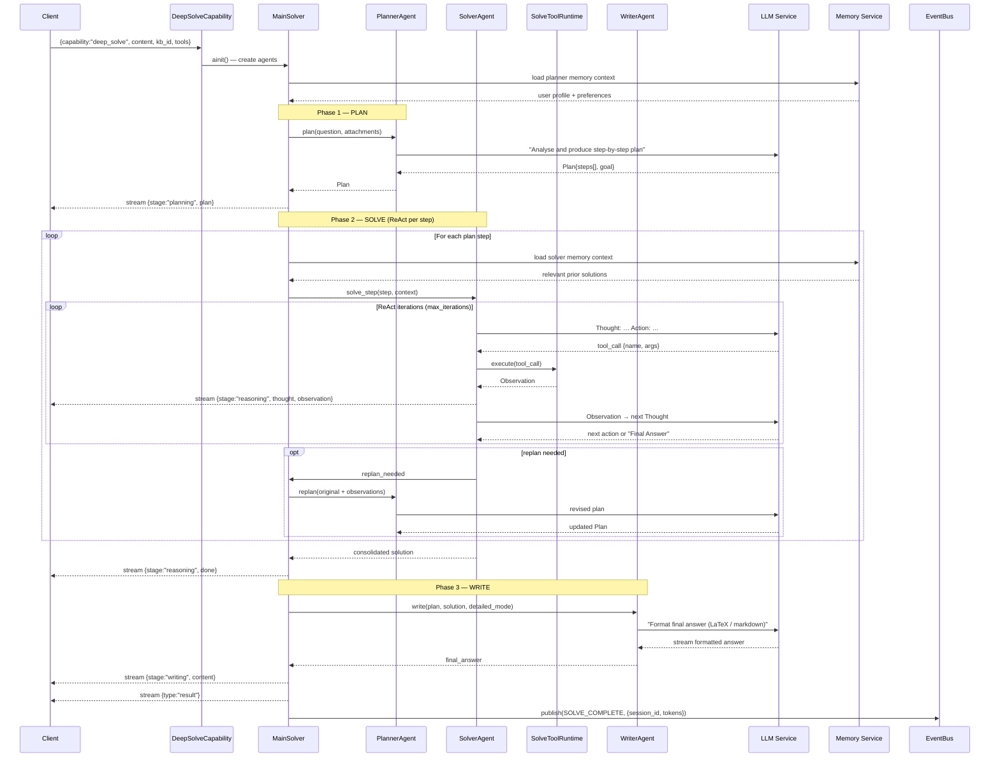

---

## 5. Deep Question — Idea → Generate → Validate

Generates an exam question bank through a three-stage ideation and evaluation
pipeline.

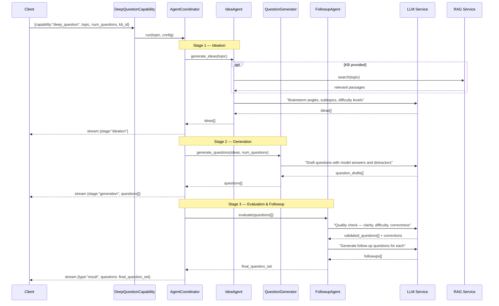

---

## 6. Deep Research — Decompose → Research → Report

Multi-agent research pipeline that decomposes a topic into sub-questions,
researches each in turn, and synthesises a cited report.

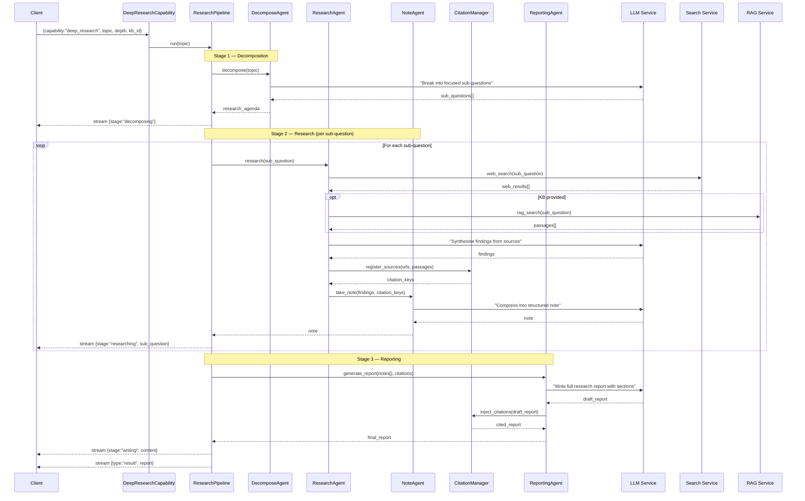

---

## 7. Knowledge Base — Document Indexing

How uploaded documents become a searchable vector index, including the
embedding endpoint normalisation introduced in v1.3.2.

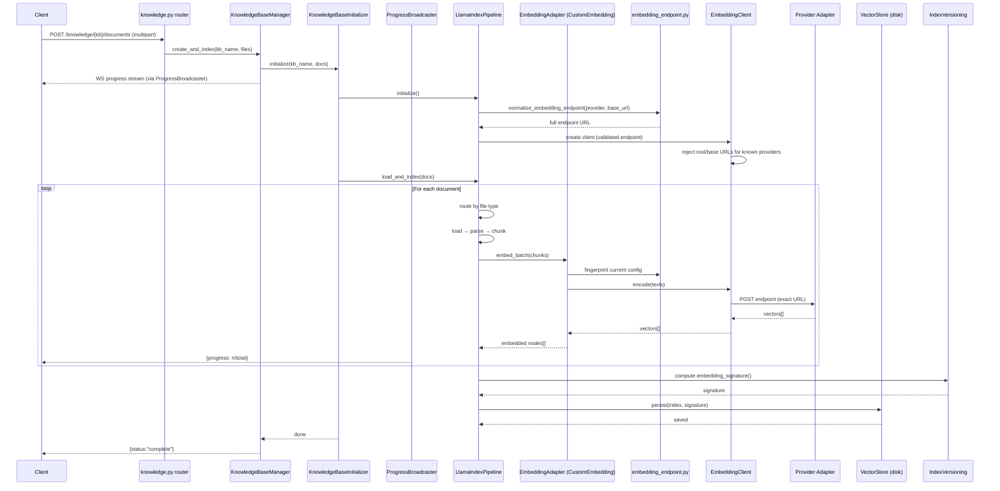

---

## 8. Knowledge Base — RAG Retrieval

How a user query travels from the RAG tool through vector search back to the
LLM prompt. Includes the vector validation added in v1.3.2.

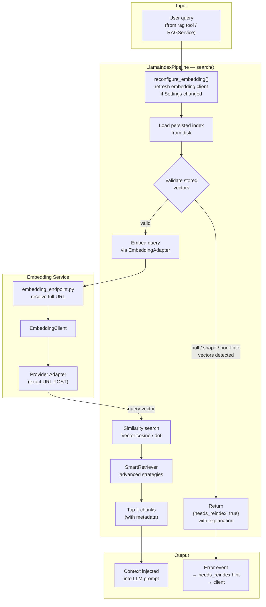

---

## 9. Embedding System — Endpoint Transparency (v1.3.2)

End-to-end flow showing how an embedding URL set in the UI becomes the exact
URL POSTed to, with no hidden path appending.

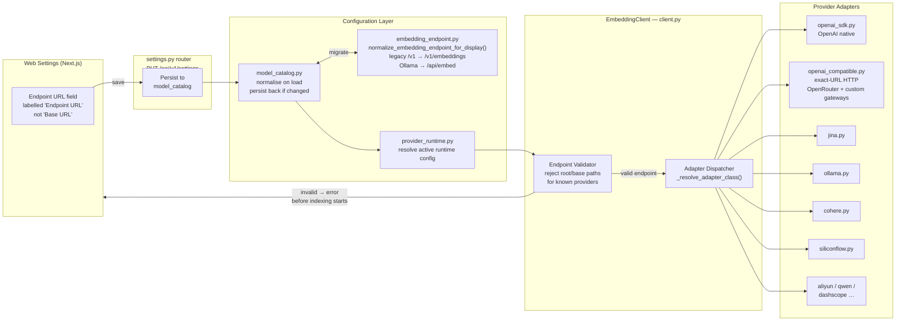

---

## 10. Memory System — Update & Cleanup (v1.3.2)

How user memory files are written after each turn, with thinking-tag stripping
applied to prevent `<think>` blocks from reasoning models being persisted.

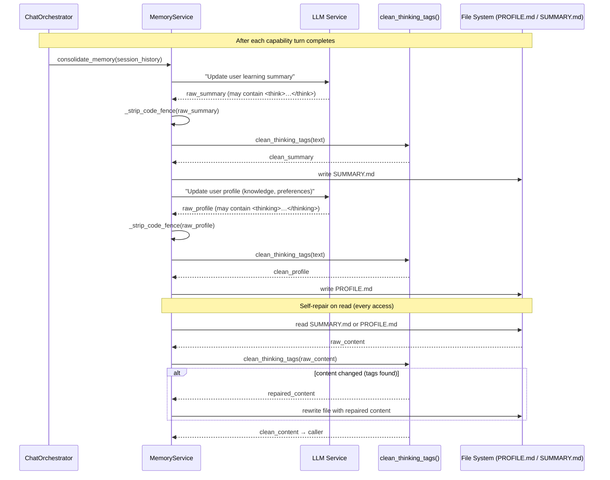

---

## 11. TutorBot — Multi-Channel Autonomous Agent

TutorBot is a parallel autonomous agent system, separate from the main
capability pipeline, with its own agent loop and channel receivers.

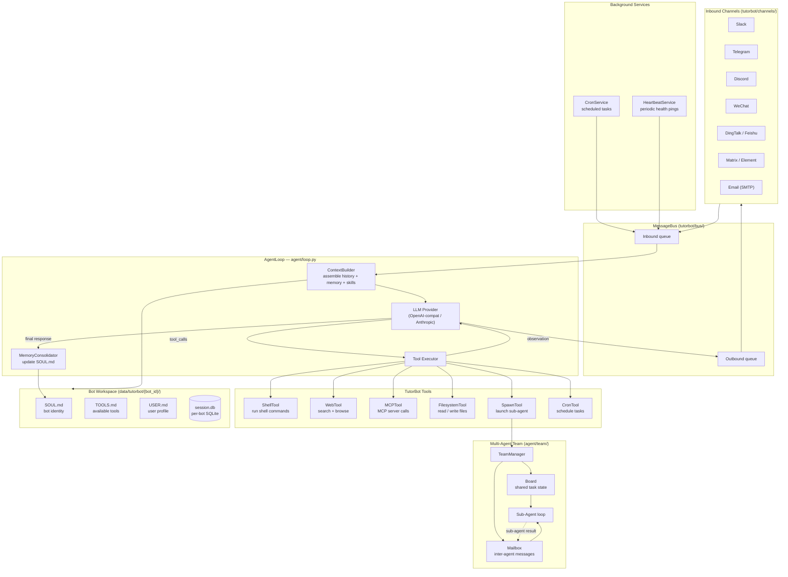

---

## 12. Session & State Management

How conversation state is stored and loaded, including history compression for
long sessions.

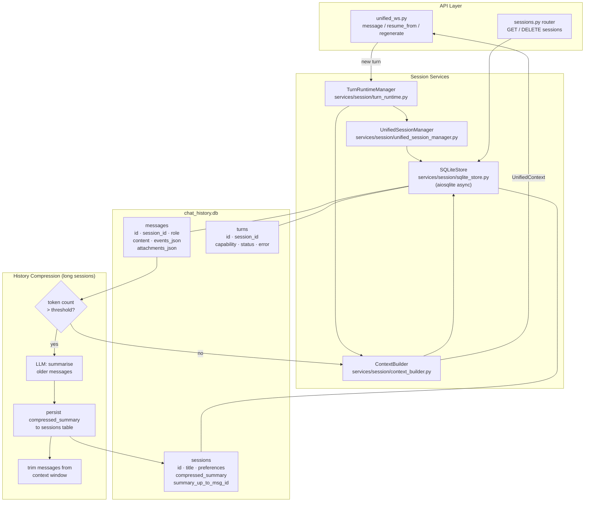

---

## 13. Co-Writer — Document Editing & AI Assistance

The Co-Writer module is a standalone writing workspace. It has two independent
subsystems: document storage (CRUD) and AI-assisted editing (two modes).

### 13a. Document Management

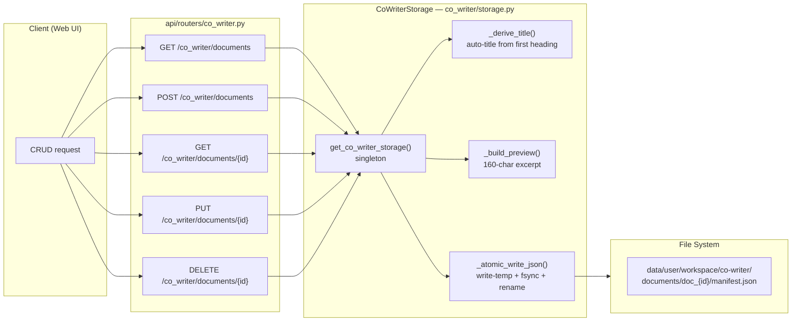

### 13b. Simple Edit (EditAgent)

Fetches optional context (RAG or web search) then makes a single LLM call.

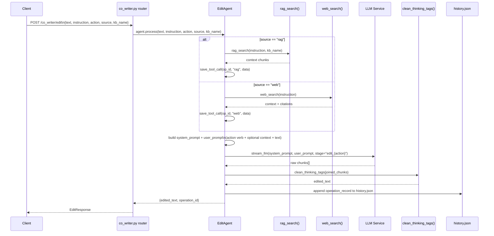

### 13c. ReAct Edit (react_edit) — AI-assisted with tool use

Uses the full agentic pipeline with optional RAG, web search, brainstorm,
paper search, and code execution tools. Supports both blocking and streaming
response modes.

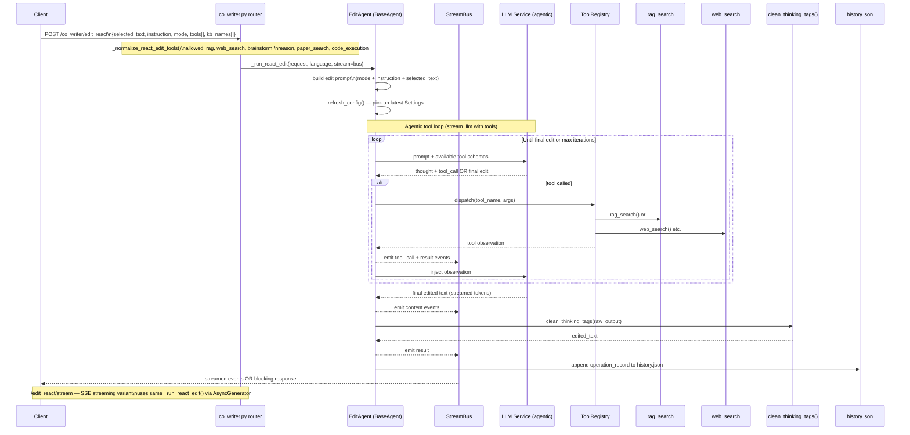

---

## 14. Module Dependency Hierarchy

The six strict dependency layers guarantee that inner layers never import outer
ones. TutorBot is a parallel system with its own stack.

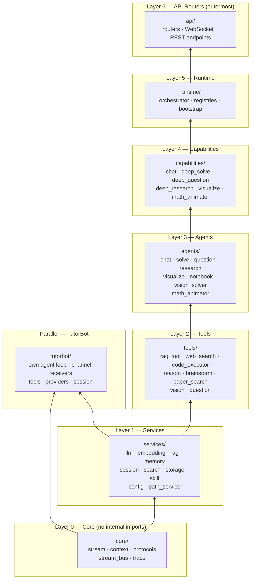
